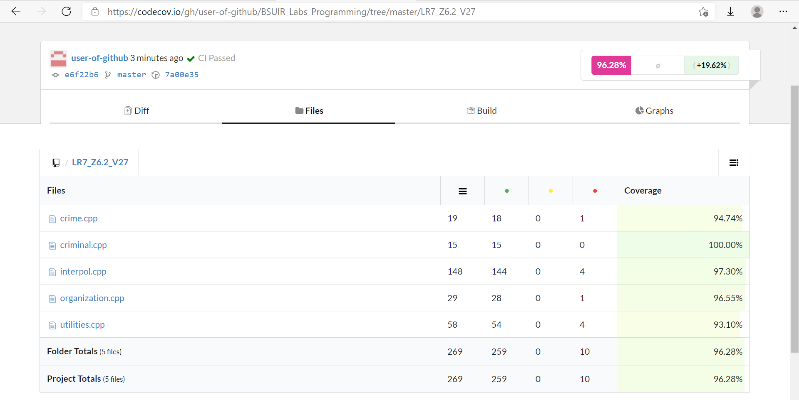

## Лабораторная работа № 7  
### Задание 6.2 (27). Интерпол 
&nbsp;
##### _Демонстрация_:
###### (Процент покрытия тестами файлов):

&nbsp;

######  При поддержке [CodeCov](https://about.codecov.io/) 
###### © 2021